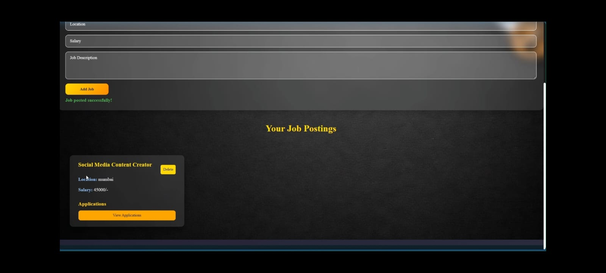

# 💼HireHub: Job Board Application

A full-stack Job Board web application that connects recruiters and job seekers on a single platform. Recruiters can post and manage job openings, while candidates can search, view, and apply for jobs with resume uploads.

---

## 🚀 Features

### 👤 Authentication & Authorization

* User Registration and Login
* JWT-based Authentication
* Role-Based Access Control (Recruiter / Candidate)
* Secure Password Hashing

### 🏢 Recruiter Features

* Create and Post Job Listings
* Manage Posted Jobs
* View Applications Received
* Update or Delete Job Posts

### 👨‍💼 Candidate Features

* Browse Available Jobs
* Search and Filter Jobs
* View Detailed Job Information
* Apply for Jobs
* Upload Resume Documents

### 🔒 Security Features

* Protected API Routes
* Secure Authentication using JWT
* Input Validation
* Error Handling and Exception Management

---

## 🛠️ Tech Stack

### Frontend

* React.js
* HTML5
* CSS3
* JavaScript (ES6+)

### Backend

* Node.js
* Express.js

### Database

* MongoDB
* Mongoose

### Authentication

* JSON Web Token (JWT)
* bcrypt.js

### File Upload

* Multer

---

## 📂 Project Structure

```bash
job-board/
│
├── frontend/              # React Frontend
│   ├── public/
│   ├── src/
│   └── package.json
│
├── backend/               # Node.js Backend
│   ├── controllers/
│   ├── models/
│   ├── routes/
│   ├── middleware/
│   ├── uploads/
│   └── server.js
│
├── .gitignore
├── README.md
└── package.json
```

---

## ⚙️ Installation

### Clone Repository

```bash
git clone https://github.com/your-username/job-board.git
cd job-board
```

### Backend Setup

```bash
cd backend
npm install
```

Create a `.env` file inside the backend folder:

```env
PORT=5000
MONGO_URI=your_mongodb_connection_string
JWT_SECRET=your_secret_key
```

Start Backend Server:

```bash
npm start
```

### Frontend Setup

```bash
cd frontend
npm install
npm start
```

Frontend will run on:

```bash
http://localhost:3000
```

Backend API will run on:

```bash
http://localhost:5000
```

---

## 📡 API Endpoints

### Authentication

| Method | Endpoint           | Description   |
| ------ | ------------------ | ------------- |
| POST   | /api/auth/register | Register User |
| POST   | /api/auth/login    | Login User    |

### Jobs

| Method | Endpoint      | Description     |
| ------ | ------------- | --------------- |
| GET    | /api/jobs     | Get All Jobs    |
| GET    | /api/jobs/:id | Get Job Details |
| POST   | /api/jobs     | Create Job      |
| PUT    | /api/jobs/:id | Update Job      |
| DELETE | /api/jobs/:id | Delete Job      |

### Applications

| Method | Endpoint          | Description      |
| ------ | ----------------- | ---------------- |
| POST   | /api/apply/:jobId | Apply for Job    |
| GET    | /api/applications | Get Applications |

---

## 🎯 Future Enhancements

* Job Recommendation System using AI
* Resume Parsing
* Email Notifications
* Interview Scheduling
* Advanced Search Filters
* Company Profiles
* Admin Dashboard
* Real-Time Chat between Recruiters and Candidates

---

## 📸 Screenshots

Add screenshots of your application here.

### Home Page


### Job Listings


### Recruiter Dashboard



---

## 🤝 Contributing

Contributions are welcome.

1. Fork the repository
2. Create a feature branch

```bash
git checkout -b feature-name
```

3. Commit changes

```bash
git commit -m "Add feature"
```

4. Push to GitHub

```bash
git push origin feature-name
```

5. Create a Pull Request

---

## 👩‍💻 Author

**Triveni**

Bachelor of Engineering (Computer Science)

Interested in Full Stack Development, Artificial Intelligence, Machine Learning, and Data Analytics.
